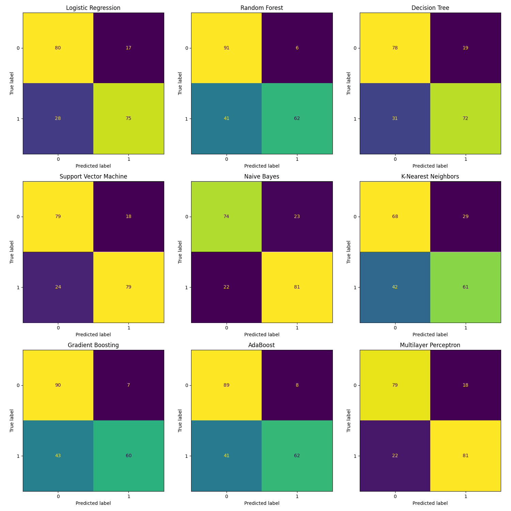

# Sentiment Analysis of Restaurant Reviews

## Index

- [Introduction](#introduction)
- [Methods](#methods)
- [Results](#results)
- [Discussion](#discussion)
- [Conclusion](#conclusion)
- [Referenes](#references)

## Introduction

This project aims to compare various classification models on the task of sentiment analysis of restaurant reviews. The goal is to determine which model performs best in classifying reviews as positive or negative based on their text content.

## Methods

We used the following classification models:

1. **Logistic Regression (Maximum Entropy)**
2. **Random Forest Classifier**
3. **Decision Tree Classifier (CART)**
4. **Support Vector Machine (SVM)**
5. **Naive Bayes**
6. **K-Nearest Neighbors (KNN)**
7. **Gradient Boosting Classifier**
8. **AdaBoost Classifier**
9. **Multilayer Perceptron (Neural Network)**

### Data Preprocessing

- **Text Cleaning:** Removed non-alphabetic characters, converted text to lowercase, removed stopwords (excluding 'not'), and applied stemming.
- **Feature Extraction:** Used Bag of Words model with `CountVectorizer`.
- **Dataset Split:** Split the data into training and test sets with an 80-20 ratio.

### Evaluation Metrics

Evaluated each model using the following metrics:

- **Accuracy**
- **Precision**
- **Recall**
- **F1 Score**

## Results

**Model Performance Comparison:**

| Model                   | Accuracy | Precision | Recall | F1 Score |
|-------------------------|----------|-----------|--------|----------|
| Logistic Regression     | 0.7750   | 0.8152    | 0.7282 | 0.7692   |
| Random Forest           | 0.7650   | 0.9118    | 0.6019 | 0.7251   |
| Decision Tree           | 0.7500   | 0.7912    | 0.6990 | 0.7423   |
| Support Vector Machine  | 0.7900   | 0.8144    | 0.7670 | 0.7900   |
| Naive Bayes             | 0.7750   | 0.7788    | 0.7864 | 0.7826   |
| K-Nearest Neighbors     | 0.6450   | 0.6778    | 0.5922 | 0.6321   |
| Gradient Boosting       | 0.7500   | 0.8955    | 0.5825 | 0.7059   |
| AdaBoost                | 0.7550   | 0.8857    | 0.6019 | 0.7168   |
| Multilayer Perceptron   | 0.8000   | 0.8182    | 0.7864 | 0.8020   |

**Confusion Matrices:**

## Discussion

Based on the results, we can make several observations about the performance of the models:

1. **Multilayer Perceptron (Neural Network):**
   - **Highest Accuracy (80.00%)**: The MLP classifier achieved the highest accuracy among all models.
   - **Balanced Precision and Recall**: With a precision of 81.82% and recall of 78.64%, it shows a good balance between correctly identifying positive reviews and capturing all actual positive reviews.
   - **Highest F1 Score (80.20%)**: The high F1 score indicates a strong overall performance.

2. **Support Vector Machine:**
   - **Second-Highest Accuracy (79.00%)**: The SVM classifier performed closely behind the MLP.
   - **Strong Recall (76.70%)**: It has a slightly higher recall than MLP, indicating it captured more true positives.
   - **Good Precision (81.44%)**: Precision is comparable to MLP, meaning it was effective at avoiding false positives.

3. **Logistic Regression and Naive Bayes:**
   - **Similar Performance (Accuracy 77.50%)**: Both models performed equally in terms of accuracy.
   - **Naive Bayes Higher Recall (78.64%)** vs. Logistic Regression (72.82%): Naive Bayes was better at identifying actual positive reviews.
   - **Logistic Regression Higher Precision (81.52%)** vs. Naive Bayes (77.88%): Logistic Regression was better at ensuring that positive predictions were correct.

4. **Random Forest, Decision Tree, Gradient Boosting, and AdaBoost:**
   - **Moderate Accuracy (75.00% - 76.50%)**: These tree-based models had moderate accuracy.
   - **High Precision, Lower Recall**: Random Forest and Gradient Boosting had high precision (91.18% and 89.55%, respectively) but lower recall (60.19% and 58.25%), indicating they were conservative in predicting positive reviews, resulting in fewer false positives but missing more true positives.
   - **AdaBoost and Gradient Boosting had similar performance**, suggesting that boosting methods may require further tuning for better results.

5. **K-Nearest Neighbors:**
   - **Lowest Accuracy (64.50%)**: KNN performed the worst among all models.
   - **Lower Precision and Recall**: With precision at 67.78% and recall at 59.22%, it struggled to correctly classify reviews.

### Trade-offs:

- **Precision vs. Recall:** Models like Random Forest and Gradient Boosting had high precision but lower recall, indicating they were more precise but missed more positive reviews. In contrast, models like Naive Bayes had higher recall but slightly lower precision.
- **Complexity vs. Performance:** While models like MLP and SVM performed best, they may require more computational resources compared to simpler models like Logistic Regression.

### Model Selection Considerations:

- **Multilayer Perceptron** offers the best overall performance but may require more tuning and computational power.
- **Support Vector Machine** provides strong performance with potentially less computational cost than neural networks.
- **Logistic Regression** is a good baseline with solid performance and is easier to implement and interpret.

## Conclusion

After evaluating various classification models on the restaurant reviews dataset, the **Multilayer Perceptron (Neural Network)** emerged as the best-performing model, closely followed by the **Support Vector Machine**. Both models demonstrated high accuracy and balanced precision and recall.

For applications where computational resources are limited, **Logistic Regression** offers a good balance of performance and simplicity. Models like **Random Forest** and **Gradient Boosting** may require further tuning to improve recall if capturing all positive reviews is critical.

Overall, the choice of model should consider the specific requirements of the task, such as the importance of precision vs. recall, computational resources, and the need for model interpretability.

## **References**

1. Machine Learning A-Z: AI, Python & R [2024]  
Created by Hadelin de Ponteves, Kirill Eremenko, SuperDataScience Team, and the Ligency Team  
[https://www.udemy.com/course/machinelearning/](https://www.udemy.com/course/machinelearning/)

